# Run Java Migration Analysis

## Introduction

This lab walks you through the steps to run Java Migration Analysis on any Java application on your Fleet.

Estimated Time: 30 mins

### Objectives

In this lab, you will:

* Create a Java Migration Analysis Work Request using the Java Management Service console interface.
* View and monitor the status of Work Requests created using the Java Management Service console interface.
* View/download the generated Java Migration Analysis report.

### Prerequisites

* You have signed up for an account with Oracle Cloud Infrastructure and have received your sign-in credentials.
* You are using an Oracle Linux image or Windows OS on your Managed Instance for this workshop.
* Access to the cloud environment and resources configured in [Lab 1](?lab=set-up-and-enable-advanced-features-on-java-management-service).
* Have a Java application compiled and run at least once with JDK 8 on your instance.

## Task 1: Submit Java Migration Analysis Work Request

1. First, open the navigation menu, click **Observability & Management**, and then click **Fleets** under **Java Management**. Select the fleet that you have configured in [Lab 1](?lab=set-up-and-enable-advanced-features-on-java-management-service).
  
    

2. Scroll down the **Fleet** details page. Under the **Resources** menu, select **Managed instances**.

    You should see a list of Managed instances that are currently in your Fleet. Select the Managed instance you are interested in.
  
    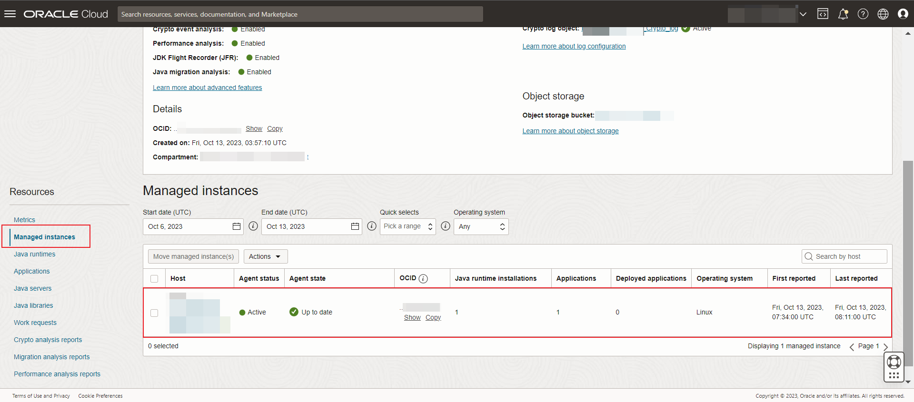

3. Scroll down and under **Resources**, select **Applications**. You should see a list of Java applications running in this managed instance. 

   You could toggle the show/hide Java runtime installation paths to view or hide the Java runtime associated with each application.
  
    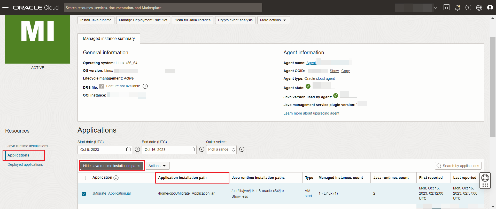

4. Select the Java application you want to run with Java migration analysis. Click on **Actions** and select **Start Java migration analysis**. 

   Java migration analysis can only be done on one application at a time, and is not applicable for deployed application on a server. 

   If more than one application is selected for analysis, the "Start Java migration analysis" option under Actions will be disabled.

   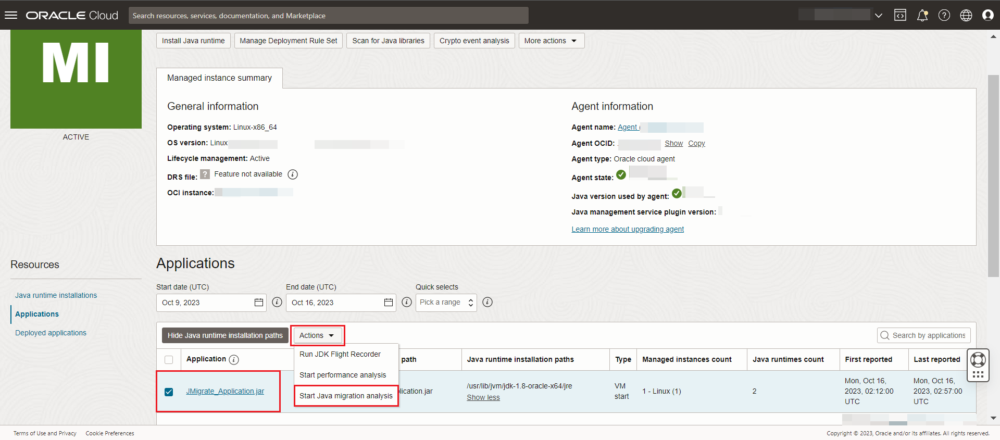

5. In the **Java migration analysis** panel, the source JDK is auto-populated to JDK 8, which is used for compiling and running this java application. 

   Under the **Target JDK for migration analysis**, click the dropdown menu and select **JDK 11**. Click **Analyze** to start the Java migration analysis.

    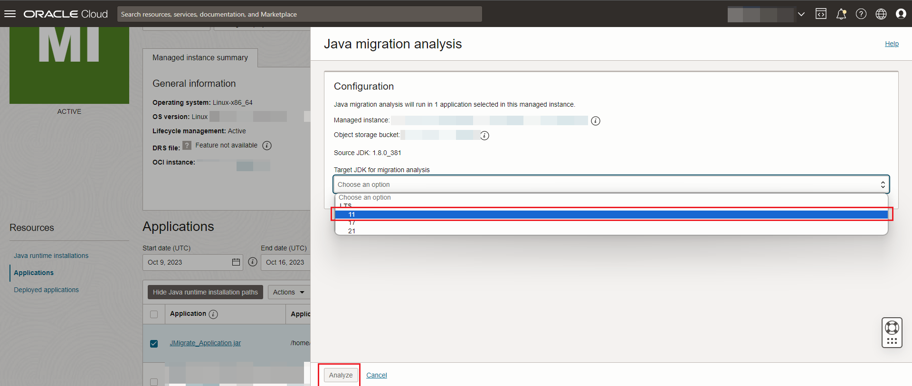

    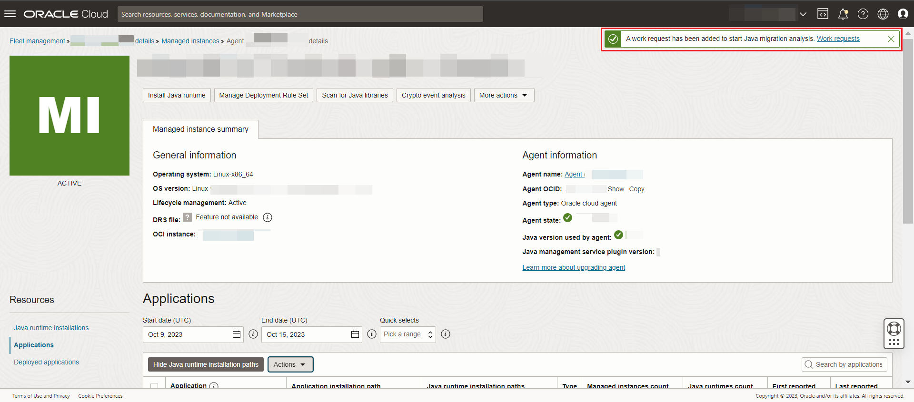

6. Click on the **fleet** name at the top of the **Managed Instance** page. This should navigate back to the **Fleet** details page.

    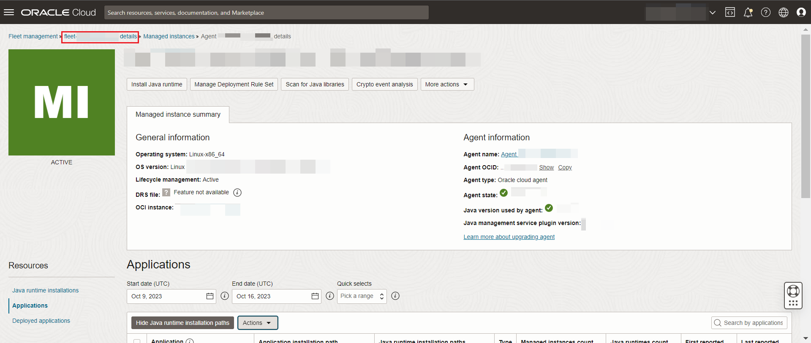

7. Scroll down to the **Resources** menu and select **Work requests**. You should see a list of the Work Requests that are currently in your Fleet.

   **Java migration analysis** that was started should be at the top of the list.
  
    

8. Wait for the work request to be processed. If the work request has been completed successfully, the status will change to **Completed without Errors**.
  
    

    >**Note:** It will take approximately 15 minutes for the request to be completed.

9. Once the work request status shows **Completed without Errors**, scroll down to the **Resources** menu and select **Migration analysis reports**.

   You should see a list of Java migration analysis reports that have been conducted in your Fleet. The latest **Java migration analysis** that has been completed should be displayed at the top of the list.
   
    The entire report can be downloaded for offline viewing by clicking on the arrow hyperlink of the zip file under Report column. More information about the downloaded report will be explained under Task 2.

    

10. Click on the **Name** of the **Java Migration Analysis report** to view the report. You should see the Report Summary Page indicating an assessment outcome of the migration effort. 

   If there are no changes required, the assessment outcome should be **None**. Otherwise, it will be Minor or Major, depending on the percentage of mandatory changes required.

    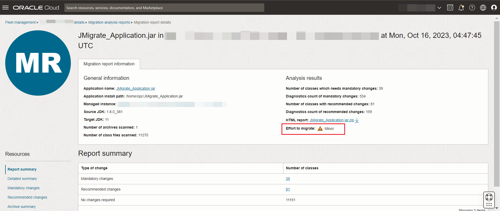

11. Select **Detailed Summary** under **Resources** to view the detailed breakdown of the type of the change, category, class count and diagnostic counts in the report . You may hover over the information icon to see the definitions of type of change, class count and diagnostics count.

   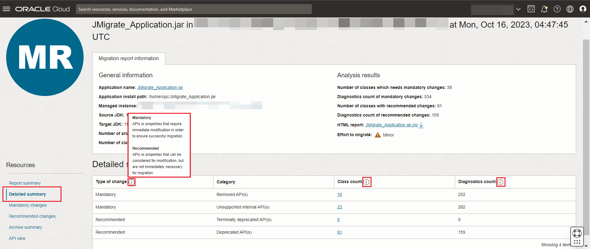

12. Select **Mandatory changes** under **Resources** to view the classes associated with this change type and the specific counts for removed API(s) as well as unsupported internal API(s).

   

13. Click on any of the hyperlinks displaying the **Removed API(s)** or **Unsupported internal API(s)** count to view the details of all the selected APIs under the specific class such as location, line number and description with a link for more information.

   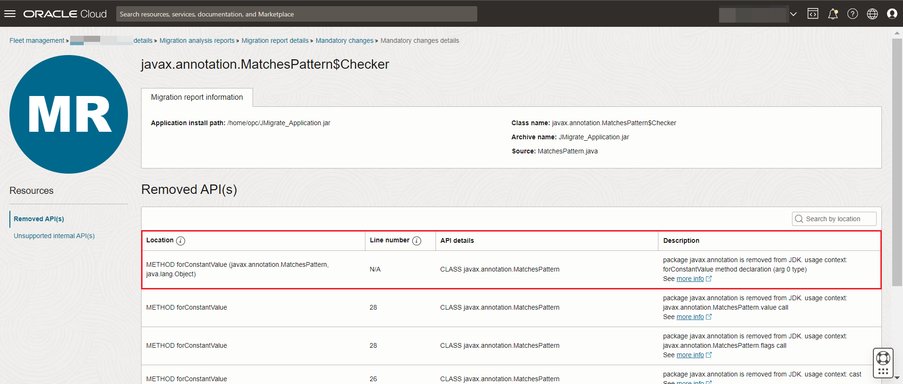

14. Click on the **Migration report details** at the top of the page to navigate back to the migration report.

    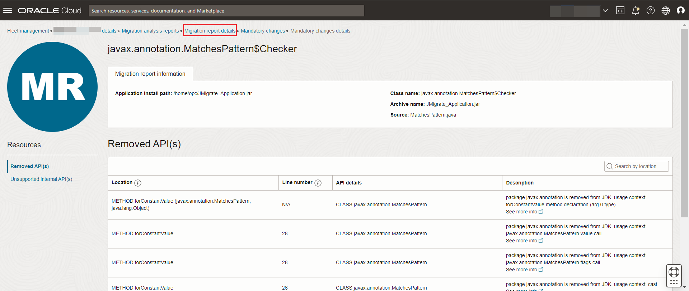

15. Select **Recommended changes** under **Resources** to view the classes associated with this change type and the specific counts for terminally deprecated as well as deprecated API(s).

   You may click any of the hyperlinks displaying the **Terminally deprecated API(s)** or **Deprecated API(s)** count to view more details.

    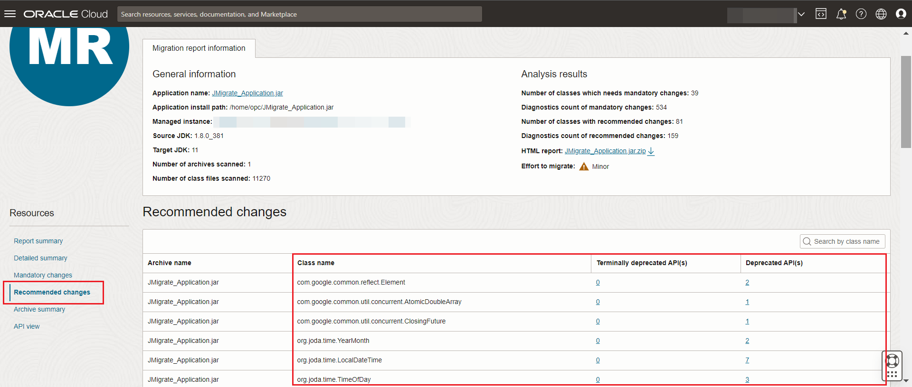

16. Navigate back to the migration report. Select **Archive summary** under **Resources** to view the details of each analysed archive that contains at least one diagnostic count of changes.

    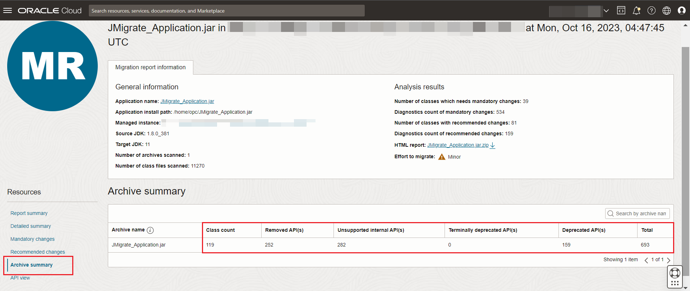

17. Select **API view** under **Resources** to view the details of the changes. Click on any of the hyperlinks displaying the **Removed API(s)** or **Unsupported internal API(s)** or **Terminally deprecated API(s)** or **Deprecated API(s)** diagnostics count to view the API occurrence details.

    

   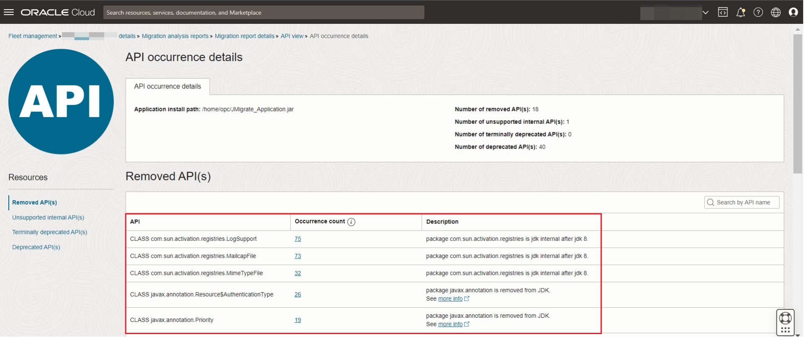

18. Click on any of the hyperlinks displaying the **Occurrence count** to view all references for a specific API.

   

## Task 2: (Optional) Download Java Migration Analysis Report

1. To access the consolidated report and the raw results in multiple json files, navigate to the **Fleet** details page and click the **Object storage bucket** name under **Object storage**.

   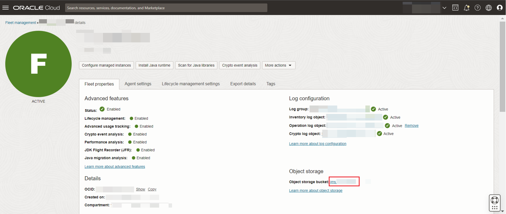

2. The **Java Migration Analysis** HTML report for the application is stored in the zip file: **JMS** > **JAVA_MIGRATION** > **fleet-ocid** > **managed-instance-ocid** > **workrequest-ocid** > **unique-id** > **application-name.zip**. 
   
   The raw results that make up the zip file are available in json file format.

    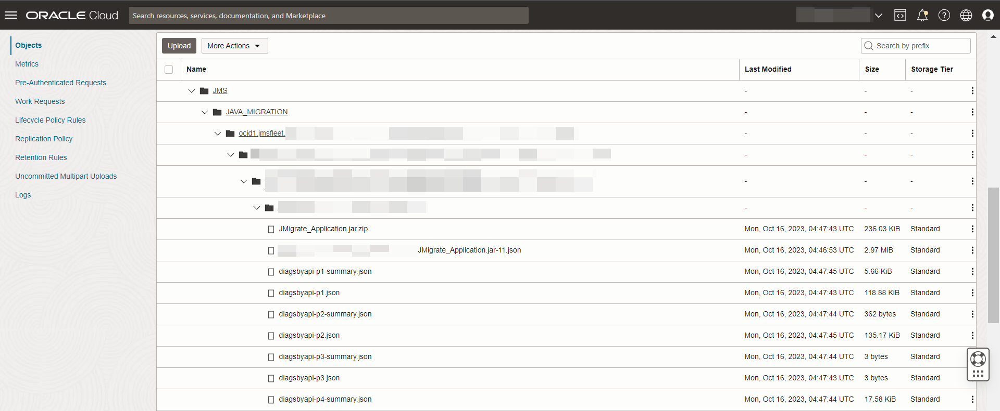

3. You can view the HTML report by opening the index.html file located in the folder, extracted from the zip file. A sample view of the report is shown below.

   

4. The report is divided into various sections.  You can go to a section by hovering on the **Go To Section** at the top right of the page and select a specific section.

   The information displayed in each section is similar to what is shown on the Oracle Cloud user console.

   

You may now **proceed to the next lab.**

## Learn More
 * Refer to the [Advanced Features](https://docs.oracle.com/en-us/iaas/jms/doc/advanced-features.html), [Work Requests](https://docs.oracle.com/en-us/iaas/jms/doc/using-java-management-service.html#GUID-77AEEBC0-93A5-4E99-96D6-BEE0FEE4539F) sections of the JMS documentation for more details.

 * Use the [Troubleshooting](https://docs.oracle.com/en-us/iaas/jms/doc/troubleshooting.html#GUID-2D613C72-10F3-4905-A306-4F2673FB1CD3) chapter for explanations on how to diagnose and resolve common problems encountered when installing or using Java Management Service.

 * If the problem still persists or it is not listed, then refer to the [Getting Help and Contacting Support](https://docs.oracle.com/en-us/iaas/Content/GSG/Tasks/contactingsupport.htm) section. You can also open a support service request using the **Help** menu in the OCI console.
 
## Acknowledgements

* **Author** - Sherlin Yeo, Java Management Service
* * **Last Updated By** - Yuan Chi Liu, Oct 2023
