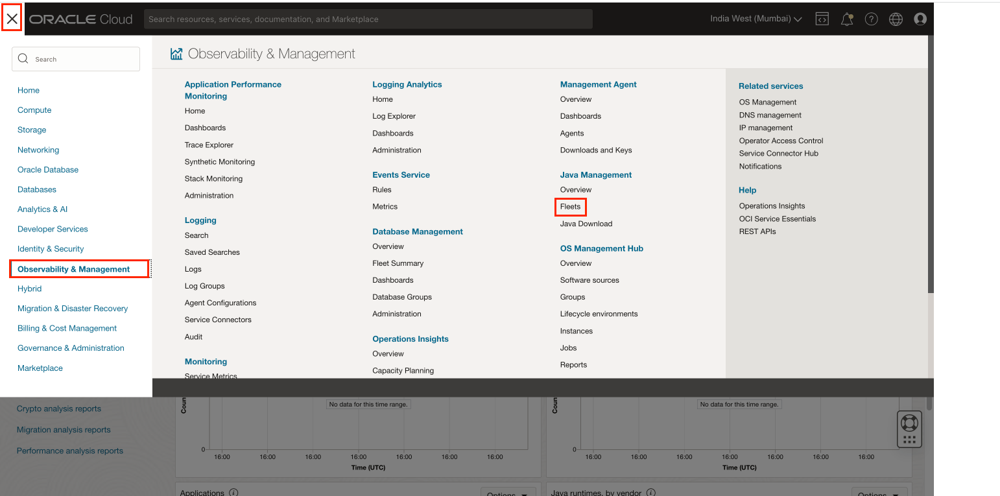
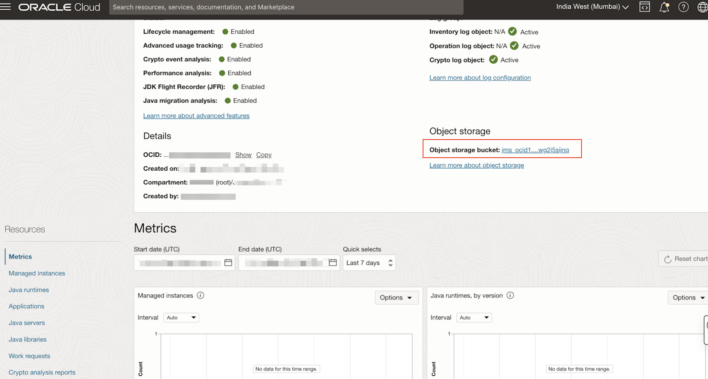
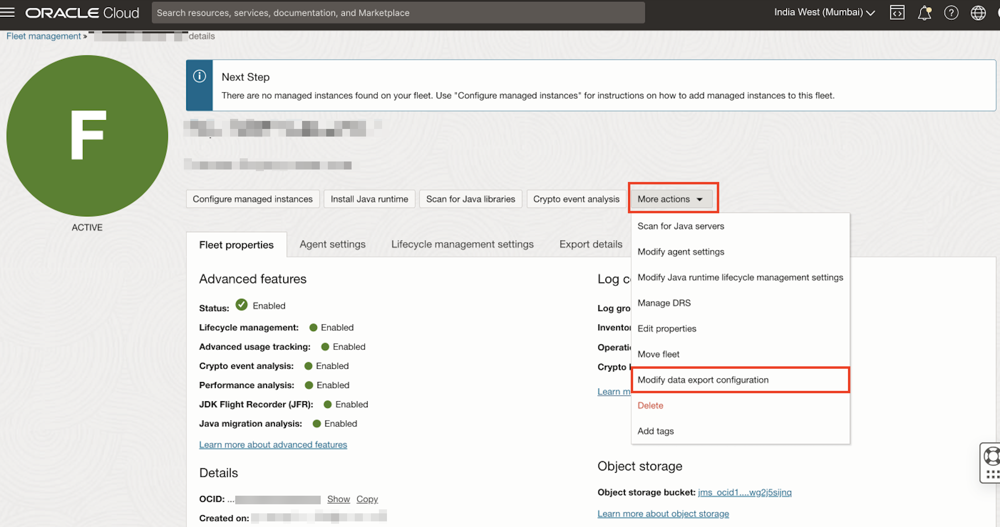
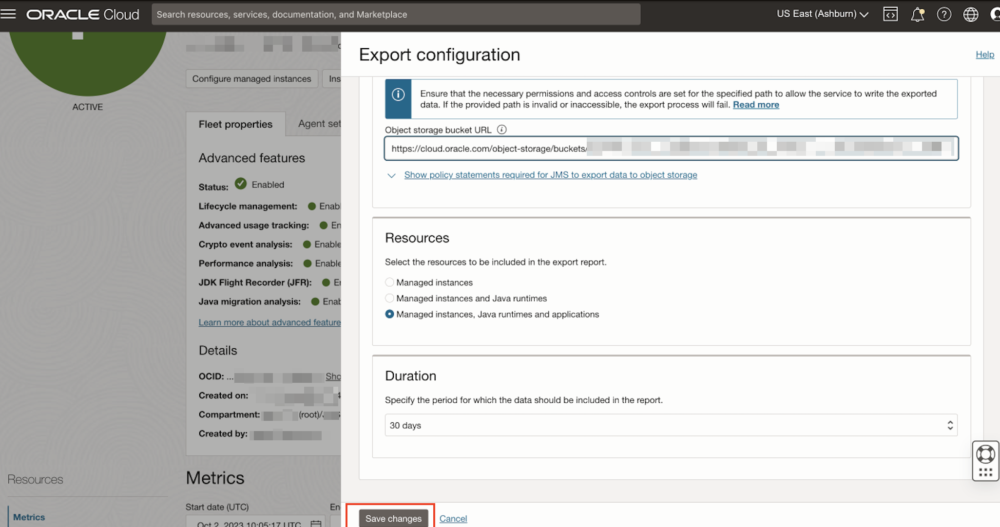
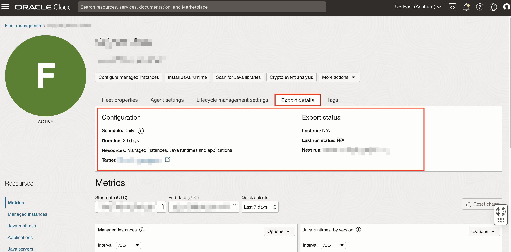
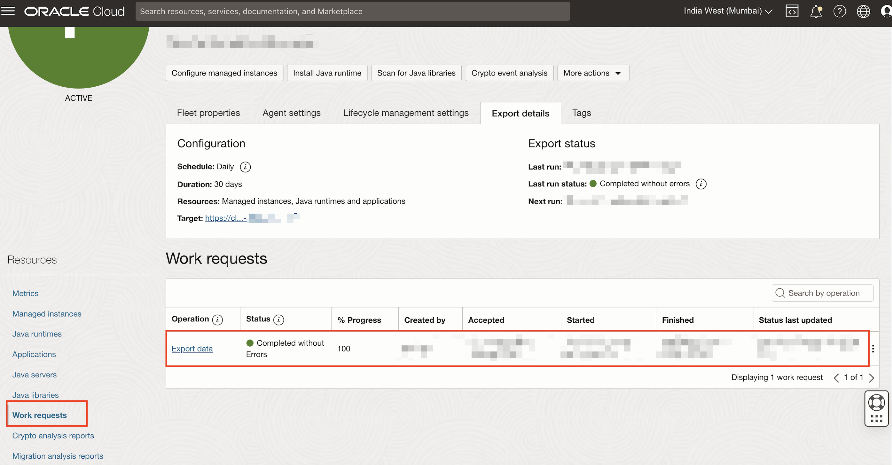
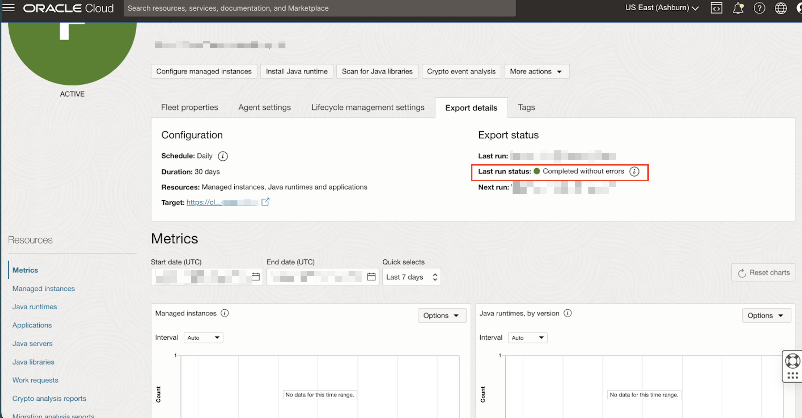
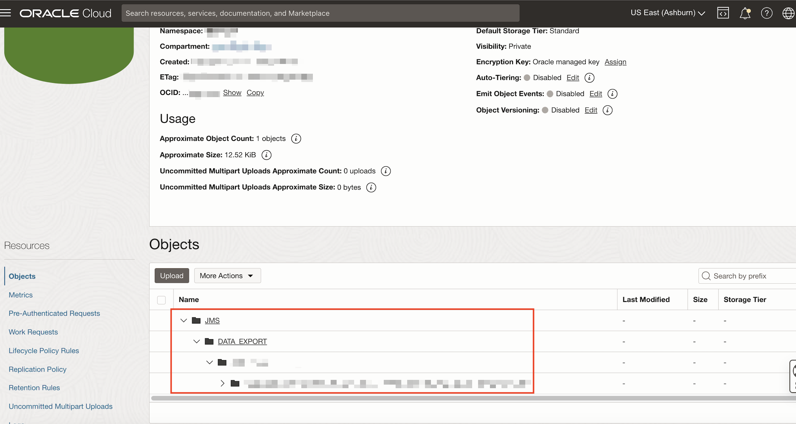

# **Exporting JMS data across Regions**

## Introduction

This lab will guide you on exporting CSV files containing JMS data from multiple regions and storing them in a designated object storage location.

Estimated Time: 15 minutes

### Objectives

In this lab, you will:

- Configure data export settings
- Check the export status
- Download the generated CSV file for further analysis.

### Prerequisites

- You have signed up for an account with Oracle Cloud Infrastructure and have received your sign-in credentials.
- Access to the cloud environment and resources configured in [Lab 2](?lab=set-up-oci-for-jms) .
- Have a fleet created according to  [Lab 3](?lab=setup-a-fleet) .
- At least one compute instance with the resources configured in Lab 1 to Lab 6.

## Task 1: Configure data export settings

  1. In the Oracle Cloud Console, open the navigation menu, click **Observability & Management**, and then click **Fleets** under **Java Management**.

  2. Select the Fleet created in [Lab 3](?lab=setup-a-fleet).

  3. Right Click the **Object storage bucket url**. Copy the **link address**.

     It will be used to indicate the storage location of files  

     

  4. Click **Modify data export configuration** under **More Actions**.

  5. Enable export setting

**Enable the export setting** and **fill the bucket URL** with link address copied before.

Click **Save changes**

## Task 2:  Verify configuration

1. Click the **Export detail**  

   

## Task 3:  (Optional) Export status

>  **Note:**  The result of the export won't be out until the next run which is at least the next day

1. Scroll down to the **Resources** menu and select **Work requests**. You should see a list of the Work Requests history a in your Fleet. And u can find **Export data** there

2. If the work request has been completed successfully the completed status will be shown under export details

## Task 4: (Optional) View files in object storage

1. Click the **Target link** under **Export details** 

   

2. The location of exported files will be 

   **JMS **> **DATA EXPORT** > **DATE** > **FLEET_OCID** > **REGION_COMARTMENT_FLEETNAME.csv**

   

You may now **proceed to the next lab.**

## Troubleshoot Exporting JMS data across Regions issues

**For Task 1**

- If you got the following warning

  

  Please check that your link is complete

## Learn More

- Use the [Troubleshooting](https://docs.oracle.com/en-us/iaas/jms/doc/troubleshooting.html#GUID-2D613C72-10F3-4905-A306-4F2673FB1CD3) chapter for explanations on how to diagnose and resolve common problems encountered when setting export data across region

* If the problem still persists or it is not listed, then refer to the [Getting Help and Contacting Support](https://docs.oracle.com/en-us/iaas/Content/GSG/Tasks/contactingsupport.htm) section. You can also open a support service request using the **Help** menu in the OCI console.

## Acknowledgements

- **Author** - Siqi Liu, Java Management Service
- **Last Updated By** - Siqi Liu, October 2023
